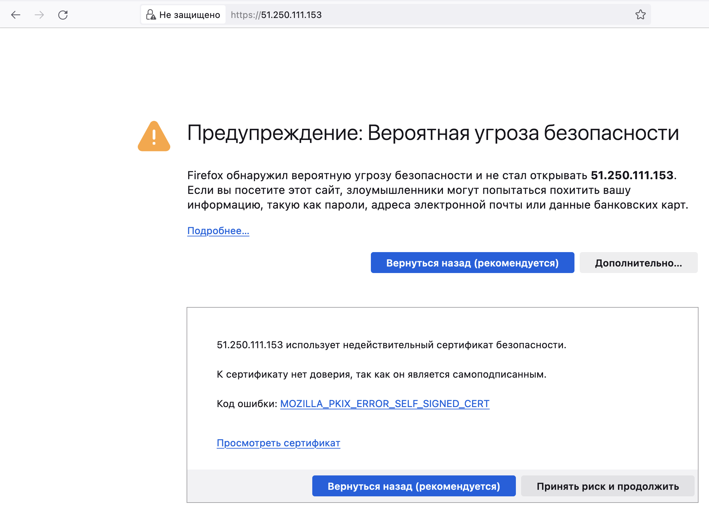
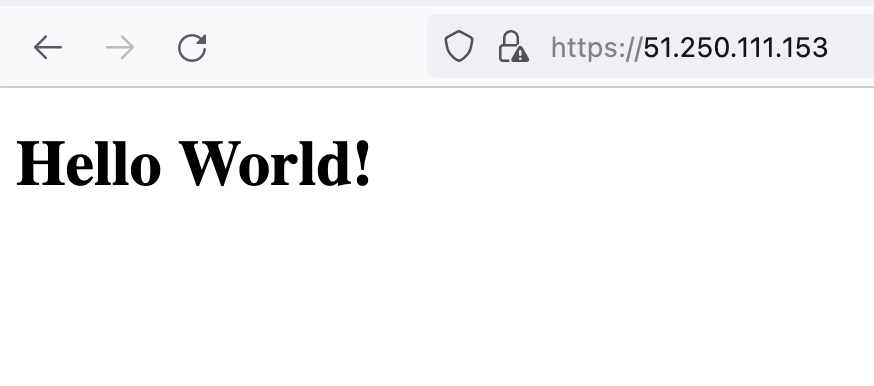

# Домашнее задание к занятию «Конфигурация приложений»

### Цель задания

В тестовой среде Kubernetes необходимо создать конфигурацию и продемонстрировать работу приложения.

------

### Задание 1. Создать Deployment приложения и решить возникшую проблему с помощью ConfigMap. Добавить веб-страницу

1. Создать Deployment приложения, состоящего из контейнеров nginx и multitool.  
[deployment.yaml](https://github.com/kibernetiq/netology_k8s/blob/kuber-hw-2-3/exercise_1/deployment.yaml)
2. Решить возникшую проблему с помощью ConfigMap.  
[configmap_env.yaml](https://github.com/kibernetiq/netology_k8s/blob/kuber-hw-2-3/exercise_1/configmap_env.yaml)
3. Продемонстрировать, что pod стартовал и оба конейнера работают.
```
yura@Skynet kubernetes % kubectl create -f configmap.yaml  
configmap/my-configmap-env created

yura@Skynet kubernetes % kubectl create -f deployment.yaml 
deployment.apps/myapp-deployment created

yura@Skynet kubernetes % kubectl get po
NAME                                READY   STATUS    RESTARTS   AGE
myapp-deployment-68766c6cf6-4jqnf   2/2     Running   0          82s
myapp-deployment-68766c6cf6-fjj94   2/2     Running   0          82s
```
4. Сделать простую веб-страницу и подключить её к Nginx с помощью ConfigMap. Подключить Service и показать вывод curl или в браузере.  
[configmap_page.yaml](https://github.com/kibernetiq/netology_k8s/blob/kuber-hw-2-3/exercise_1/configmap_page.yaml)
```
yura@Skynet kubernetes % kubectl get svc
NAME            TYPE        CLUSTER-IP      EXTERNAL-IP   PORT(S)           AGE
kubernetes      ClusterIP   10.96.0.1       <none>        443/TCP           24d
myapp-service   ClusterIP   10.103.148.45   <none>        80/TCP,1180/TCP   19h

yura@Skynet kubernetes % kubectl port-forward service/myapp-service 8080:80   
Forwarding from 127.0.0.1:8080 -> 80
Forwarding from [::1]:8080 -> 80
Handling connection for 8080
```
```
yura@Skynet kubernetes % curl -vk localhost:8080
*   Trying 127.0.0.1:8080...
* Connected to localhost (127.0.0.1) port 8080 (#0)
> GET / HTTP/1.1
> Host: localhost:8080
> User-Agent: curl/8.1.2
> Accept: */*
> 
< HTTP/1.1 200 OK
< Server: nginx/1.14.2
< Date: Wed, 15 Nov 2023 13:16:55 GMT
< Content-Type: text/html
< Content-Length: 68
< Last-Modified: Tue, 14 Nov 2023 18:50:54 GMT
< Connection: keep-alive
< ETag: "6553c18e-44"
< Accept-Ranges: bytes
< 
<!DOCTYPE html>
<html>
<body>
<h1>Hello World!</h1>
</body>
</html>
* Connection #0 to host localhost left intact
```
5. Предоставить манифесты, а также скриншоты или вывод необходимых команд.

------

### Задание 2. Создать приложение с вашей веб-страницей, доступной по HTTPS 

1. Создать Deployment приложения, состоящего из Nginx.  
[deployment.yaml](https://github.com/kibernetiq/netology_k8s/blob/kuber-hw-2-3/exercise_2/deployment.yaml)
2. Создать собственную веб-страницу и подключить её как ConfigMap к приложению.  
[configmap.yaml](https://github.com/kibernetiq/netology_k8s/blob/kuber-hw-2-3/exercise_2/configmap.yaml)
3. Выпустить самоподписной сертификат SSL. Создать Secret для использования сертификата.  
[secret.yaml](https://github.com/kibernetiq/netology_k8s/blob/kuber-hw-2-3/exercise_2/secret.yaml)
```
sudo openssl req -x509 -nodes -days 365 -newkey rsa:2048 -keyout /etc/ssl/private/key.key -out /etc/ssl/certs/cer.crt
```
4. Создать Ingress и необходимый Service, подключить к нему SSL в вид. Продемонстировать доступ к приложению по HTTPS.  
[ingress.yaml](https://github.com/kibernetiq/netology_k8s/blob/kuber-hw-2-3/exercise_2/ingress.yaml)
5. Предоставить манифесты, а также скриншоты или вывод необходимых команд.
<p align="center">
  
</p>

<p align="center">
  
</p>